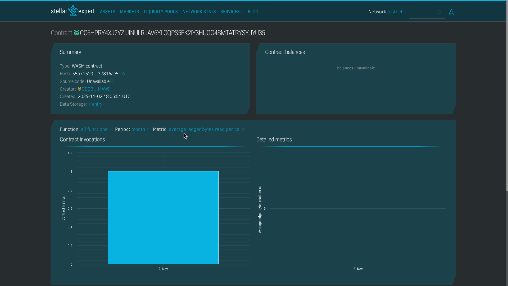

# TipStar ✨

**Support your favorite star.**

A decentralized tipping platform built on Stellar Soroban that enables content creators to receive crypto tips directly from their fans. TipStar provides a simple widget that creators can embed on websites or social media platforms, making it effortless for fans to show their appreciation.

---

## 📋 Table of Contents

- [Description](#description)
- [Deployed Contract](#deployed-contract)
- [Key Features](#key-features)
- [Vision](#vision)
- [Future Plans](#future-plans)
- [Getting Started](#getting-started)
- [Contract Functions](#contract-functions)
- [Development](#development)
- [Testing](#testing)
- [Contributing](#contributing)
- [License](#license)

---

## 📝 Description

TipStar is a smart contract solution on the Stellar blockchain that simplifies the tipping experience for content creators and their fans. Built using Stellar's Soroban smart contract platform, TipStar allows creators to embed a lightweight widget on their websites, blogs, or social media profiles, enabling instant crypto tips.

The platform eliminates traditional payment intermediaries, reducing fees and enabling direct, instant transfers. Each tip is recorded on-chain, providing transparent and verifiable transaction history for both creators and supporters.

### How It Works

1. **Content creators** set up their TipStar widget on their platform
2. **Fans** can send tips directly using the embedded widget
3. **Tips** are recorded on the Stellar blockchain with messages and timestamps
4. **Creators** can view their tip history, statistics, and recent activity
5. **Widget** displays recent tips from all creators, creating social proof

---

## 🌐 Deployed Contract

Contract ID:

> CC6HPRY4XJ2YZIJINULRJAV6YLGQPS5EK2IY3HUGG4SMTATRYSYUYU35

### Contract Explorer

View the contract on [Stellar Expert](https://stellar.expert/explorer/testnet/contract/CC6HPRY4XJ2YZIJINULRJAV6YLGQPS5EK2IY3HUGG4SMTATRYSYUYU35)


---

## ✨ Key Features

### 🔹 **Direct Tipping**

- Send tips directly from fans to creators
- Support for custom messages with each tip
- Instant blockchain confirmation
- Minimal transaction fees

### 🔹 **Tip History & Analytics**

- Complete tip history per creator
- Real-time statistics tracking:
  - Total tips received
  - Tip count
  - Last tip timestamp
- Paginated queries for efficient data retrieval

### 🔹 **Public Feed**

- Recent tips feed across all creators
- Social proof for widget displays
- Configurable limit (default: 20, max: 100)

### 🔹 **Transparent & Verifiable**

- All tips recorded on-chain
- Immutable tip records with unique IDs
- Publicly accessible tip history
- Timestamped transactions

### 🔹 **Developer Friendly**

- Simple, well-documented contract interface
- Type-safe contract bindings
- Comprehensive test coverage
- Easy integration with frontend applications

---

## 🎯 Vision

TipStar aims to revolutionize how content creators monetize their work by providing a direct, transparent, and efficient way for fans to support creators they love. Our vision includes:

### **Democratizing Creator Monetization**

- Enable creators of all sizes to receive direct support
- Remove barriers to entry (no complex payment processors needed)
- Support creators globally, regardless of geographic location

### **Building a Supportive Ecosystem**

- Create a platform where appreciation is easily expressed
- Foster stronger connections between creators and their communities
- Provide transparent metrics that showcase community support

### **Blockchain-Powered Transparency**

- Leverage Stellar's fast, low-cost transactions
- Ensure all transactions are verifiable and transparent
- Build trust through decentralized, immutable records

### **Global Accessibility**

- Work seamlessly across borders
- Support multiple currencies through Stellar's asset ecosystem
- Minimal fees enable micro-tipping

---

## 🚀 Future Plans

### **Phase 1: Enhanced Features** (Q1-Q2 2024)

- [ ] Multi-asset support (USDC, XLM, and custom tokens)
- [ ] Recurring subscription/tips functionality
- [ ] Tip goals and milestones tracking
- [ ] Enhanced analytics dashboard
- [ ] Notification system for creators

### **Phase 2: Widget & Integration** (Q2-Q3 2024)

- [ ] Production-ready embeddable widget
- [ ] WordPress plugin
- [ ] Shopify app integration
- [ ] Social media platform integrations
- [ ] API for custom integrations

### **Phase 3: Social Features** (Q3-Q4 2024)

- [ ] Creator profiles and verification
- [ ] Public tip leaderboards
- [ ] Tip streaks and badges
- [ ] Community voting on featured creators
- [ ] Tip sharing on social media

### **Phase 4: Advanced Features** (2025)

- [ ] Cross-chain support
- [ ] NFT rewards for top supporters
- [ ] Creator subscription tiers
- [ ] Analytics and insights API
- [ ] Mobile app for creators and fans

### **Long-term Vision**

- **Platform Independence**: Enable creators to monetize without platform lock-in
- **Global Scale**: Support creators worldwide with minimal barriers
- **Community Governance**: Decentralized governance for platform evolution
- **Open Source Ecosystem**: Build a community-driven platform with open-source contributions

---

## 🚀 Getting Started

### Prerequisites

- [Rust](https://www.rust-lang.org/tools/install) (latest stable version)
- [Stellar CLI](https://developers.stellar.org/docs/build/smart-contracts/getting-started) (soroban-cli)
- A Stellar account for deployment

### Installation

1. Clone the repository:

```bash
git clone https://github.com/yourusername/TipStar-Soroban.git
cd TipStar-Soroban
```

2. Build the contract:

```bash
cargo build --target wasm32-unknown-unknown --release
```

3. Deploy to testnet:

```bash
soroban contract deploy \
  --wasm target/wasm32-unknown-unknown/release/hello_world.wasm \
  --source YOUR_SOURCE_ACCOUNT \
  --network testnet
```

4. Generate TypeScript bindings:

```bash
soroban contract bindings typescript \
  --network testnet \
  --contract-id YOUR_CONTRACT_ID \
  --output-dir ./bindings
```

---

## 📚 Contract Functions

### `send_tip(from: Address, to: Address, amount: i128, message: String) -> u64`

Send a tip from a fan to a content creator. Returns the tip ID.

**Parameters:**

- `from`: Address of the sender (must be authenticated)
- `to`: Address of the content creator
- `amount`: Tip amount (in smallest unit of the asset)
- `message`: Optional message from the fan

### `get_tip(tip_id: u64) -> Tip`

Retrieve a specific tip by its ID.

### `get_creator_tips(creator: Address, limit: Option<u32>, offset: Option<u32>) -> Vec<Tip>`

Get paginated tips for a specific creator (most recent first).

**Parameters:**

- `creator`: Address of the content creator
- `limit`: Maximum tips to return (default: 50, max: 100)
- `offset`: Number of tips to skip (default: 0)

### `get_creator_stats(creator: Address) -> CreatorStats`

Get aggregated statistics for a creator.

**Returns:**

- `creator`: Creator's address
- `total_received`: Total amount received across all tips
- `tip_count`: Total number of tips received
- `last_tip_timestamp`: Timestamp of the most recent tip

### `get_recent_tips(limit: Option<u32>) -> Vec<Tip>`

Get recent tips across all creators for widget display.

**Parameters:**

- `limit`: Maximum tips to return (default: 20, max: 100)

### `get_total_tip_count() -> u64`

Get the total number of tips sent across the entire platform.

---

## 🔧 Development

### Project Structure

```
TipStar-Soroban/
├── contracts/
│   └── hello-world/
│       ├── src/
│       │   ├── lib.rs      # Main contract implementation
│       │   └── test.rs     # Contract tests
│       └── Cargo.toml
├── Cargo.toml
└── README.md
```

### Build for Development

```bash
cargo build --manifest-path contracts/hello-world/Cargo.toml
```

### Build for Production

```bash
cargo build --target wasm32-unknown-unknown --release --manifest-path contracts/hello-world/Cargo.toml
```

---

## 🧪 Testing

Run the test suite:

```bash
cargo test --manifest-path contracts/hello-world/Cargo.toml
```

The contract includes comprehensive tests covering:

- ✅ Tip sending functionality
- ✅ Creator statistics tracking
- ✅ Tip history retrieval
- ✅ Recent tips feed
- ✅ Input validation
- ✅ Edge cases

**Test Coverage:** 7 tests, all passing ✓

---

## 📦 Contract Data Structures

### `Tip`

```rust
pub struct Tip {
    pub id: u64,
    pub from: Address,
    pub to: Address,
    pub amount: i128,
    pub message: String,
    pub timestamp: u64,
}
```

### `CreatorStats`

```rust
pub struct CreatorStats {
    pub creator: Address,
    pub total_received: i128,
    pub tip_count: u64,
    pub last_tip_timestamp: u64,
}
```

---

## 🤝 Contributing

Contributions are welcome! Please feel free to submit a Pull Request. For major changes, please open an issue first to discuss what you would like to change.

1. Fork the repository
2. Create your feature branch (`git checkout -b feature/AmazingFeature`)
3. Commit your changes (`git commit -m 'Add some AmazingFeature'`)
4. Push to the branch (`git push origin feature/AmazingFeature`)
5. Open a Pull Request

---

## 📄 License

This project is licensed under the MIT License - see the [LICENSE](LICENSE) file for details.

---

## 🔗 Resources

- [Stellar Documentation](https://developers.stellar.org/docs/build/smart-contracts/overview)
- [Soroban Examples](https://github.com/stellar/soroban-examples)
- [Stellar Expert](https://stellar.expert)

---

## 🙏 Acknowledgments

- Built on [Stellar Soroban](https://soroban.stellar.org/)
- Inspired by the creator economy and direct fan support models
- Special thanks to the Stellar Development Foundation for their excellent documentation and tools

---

## 📞 Contact & Support

- **Issues**: [GitHub Issues](https://github.com/yourusername/TipStar-Soroban/issues)
- **Discussions**: [GitHub Discussions](https://github.com/yourusername/TipStar-Soroban/discussions)

---

<div align="center">

**Made with ✨ for creators and fans**

[⬆ Back to Top](#tipstar-)

</div>
